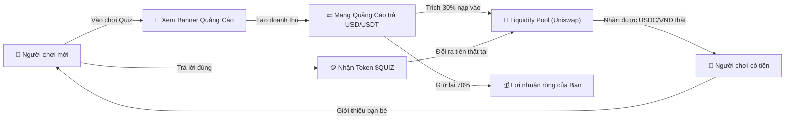

# 🚀 HƯỚNG DẪN THỰC THI THƯƠNG MẠI HÓA TOÀN DIỆN (MAINNET & MONETIZATION)
## Dự án: Quick Quiz — Learn to Earn Crypto Web3 Platform

Tài liệu này hướng dẫn chi tiết từng bước để đưa dự án **Quick Quiz** từ môi trường thử nghiệm (Testnet / Localhost) ra **vận hành thương mại thật (Mainnet)** trên thị trường toàn cầu, thu hút người chơi và tạo ra dòng tiền thật cho chủ dự án.

---

## MỤC LỤC
1. [Mô hình kinh tế & Dòng tiền (Business Model)](#1-mô-hình-kinh-tế--dòng-tiền-business-model)
2. [Bước 1: Đưa Web lên Internet (Domain & Hosting)](#bước-1-đưa-web-lên-internet-domain--hosting)
3. [Bước 2: Deploy Smart Contract lên Base Mainnet & Trạng thái Base Sepolia](#bước-2-deploy-smart-contract-lên-base-mainnet)
4. [Bước 3: Gắn Mạng Quảng Cáo & Cổng Sponsor Gate Mở Tab Mới](#bước-3-gắn-mạng-quảng-cáo-kích-hoạt-nguồn-thu)
5. [Bước 4: Tạo Thanh Khoản cho Token $QUIZ trên sàn DEX](#bước-4-tạo-thanh-khoản-cho-token-quiz-trên-sàn-dex)
6. [Bước 5: Thiết lập Chống Bot & Bảo vệ Quỹ Thưởng](#bước-5-thiết-lập-chống-bot--bảo-vệ-quỹ-thưởng)
7. [Dự toán Chi phí Vốn & Doanh thu Dự phóng (Dữ liệu Thực tế 2025–2026)](#7-dự-toán-chi-phí-vốn--doanh-thu-dự-phóng-dữ-liệu-thực-tế-20252026)
8. [Chiến lược Marketing & Mở rộng người chơi (GTM)](#8-chiến-lược-marketing--mở-rộng-người-chơi-gtm)

---

## 1. Mô hình kinh tế & Dòng tiền (Business Model)

### 1.1. Vòng lặp kinh tế tự động (Economic Flywheel)



### 1.2. Tại sao Chủ dự án KHÔNG phải bù lỗ tiền gas?
- Dự án áp dụng công nghệ **EIP-712 Structured Data Signing (Chữ ký mật ngoài chuỗi)**.
- Khi người chơi bấm nhận thưởng:
  1. Máy chủ Next.js của bạn chỉ ký một chuỗi mật mã xác nhận hợp lệ (hoàn toàn **miễn phí, 0 đồng**).
  2. Người chơi tự dùng ví MetaMask/Rainbow của họ để gửi giao dịch lên blockchain Base và **tự trả phí gas** (trên mạng Base chỉ tốn khoảng `0.001$` = 25 VNĐ / giao dịch).
  3. Dù có 10.000 hay 1.000.000 lượt claim, tài khoản của bạn **không bị trừ 1 xu phí gas nào**.

---

## Bước 1: Đưa Web lên Internet (Domain & Hosting)

Hiện tại web đang chạy tại `http://localhost:3000`. Để cả thế giới truy cập được, bạn cần tên miền và máy chủ công khai.

### 1.1. Mua Tên miền (Domain)
- Mua tại **Namecheap**, **Cloudflare Registrar** hoặc **Porkbun**.
- Đuôi tên miền khuyến nghị cho Web3: `.xyz`, `.io`, `.gg`, `.app`.
  - Ví dụ: `quickquiz.xyz`, `cryptoquiz.gg`
  - Chi phí: khoảng **2$ - 5$ / năm** đối với đuôi `.xyz`.

### 1.2. Deploy lên Vercel (Cách khuyến nghị — Miễn phí & Cực nhanh)
Vercel là nền tảng tối ưu nhất cho Next.js, có gói **Hobby (Free)** chịu tải được hàng chục nghìn lượt truy cập mỗi ngày.

1. Đăng ký tài khoản tại [https://vercel.com/](https://vercel.com/) (đăng nhập bằng tài khoản GitHub).
2. Nhấn **Add New...** ➔ **Project**.
3. Chọn kho mã nguồn GitHub của bạn: `Heizdoobert/Quiz_web`.
4. Trong phần **Environment Variables**, sao chép toàn bộ biến môi trường từ file `.env` vào:
   - `SUPABASE_URL`
   - `SUPABASE_PUBLISHABLE_KEY`
   - `SUPABASE_SECRET_KEY`
   - `NEXT_PUBLIC_SUPABASE_URL`
   - `NEXT_PUBLIC_SUPABASE_ANON_KEY`
   - `NEXT_PUBLIC_WALLET_CONNECT_PROJECT_ID`
   - `REWARD_SIGNER_PRIVATE_KEY`
   - `NEXT_PUBLIC_QUIZ_TOKEN_ADDRESS`
   - `NEXT_PUBLIC_QUIZ_BADGE_ADDRESS`
   - `NEXT_PUBLIC_CHAIN_ID`
5. Nhấn nút **Deploy**. Sau 2 phút, trang web sẽ có đường dẫn công khai (ví dụ `quick-quiz.vercel.app`).
6. Vào mục **Settings ➔ Domains** trên Vercel để trỏ tên miền riêng bạn đã mua vào.

*(Hoặc nếu bạn muốn tự chạy trên VPS Linux riêng bằng Docker, chỉ cần thuê VPS Hetzner / DigitalOcean giá ~4$/tháng và dùng lệnh `npm run docker:up` (tự động rebuild và dọn image cũ) kèm Nginx).*

---

## Bước 2: Deploy Smart Contract lên Base Mainnet

Mạng **Base Mainnet** (Chain ID: `8453`) là mạng chính thức có thanh khoản thật của Coinbase.

### 2.1. Chuẩn bị ETH thật trên Base Mainnet
1. Mua khoảng **5$ - 10$ ETH** trên sàn giao dịch (Binance, OKX, Bybit).
2. Bấm **Rút tiền (Withdraw)**:
   - Chọn mạng rút: **Base** (Base Mainnet).
   - Địa chỉ nhận: Ví của bạn (`0xEAa6c3b72E09b7B9a7656C1140761823D024aC28`).
   - Phí rút sàn Base cực kỳ rẻ (chỉ khoảng 0.0001 ETH ~ 5.000 VNĐ).

### 2.2. Thêm cấu hình Base Mainnet vào `contracts/hardhat.config.ts`
Trong file `contracts/hardhat.config.ts`, thêm network `baseMainnet`:
```typescript
baseMainnet: {
  url: "https://mainnet.base.org",
  accounts: process.env.DEPLOYER_PRIVATE_KEY ? [process.env.DEPLOYER_PRIVATE_KEY] : [],
}
```

### 2.3. Chạy lệnh Deploy lên Mainnet
Chạy lệnh sau tại thư mục dự án:
```bash
cd /mnt/second_drive/web_quiz/contracts
npx hardhat run scripts/deploy.ts --network baseMainnet
```
*(Chi phí gas deploy thực tế trên Base chỉ tốn khoảng **1.0$ - 2.5$ USD**)*.

### 2.4. Trạng thái Đã Triển khai trên Base Sepolia (Sẵn sàng Test ngay)
Hệ thống hiện đã được deploy và xác minh hoàn tất trên **Base Sepolia (Chain ID: 84532)** với các địa chỉ thực tế:
- **QuizToken ($QUIZ)**: [`0x76444237b7d382703d20CFFF4Af19f429CFbdE33`](https://sepolia.basescan.org/address/0x76444237b7d382703d20CFFF4Af19f429CFbdE33)
- **QuizBadgeNFT (QBADGE)**: [`0x6629cE07d7c4093ccb0a7bEdDDBe6cF41f9A93F9`](https://sepolia.basescan.org/address/0x6629cE07d7c4093ccb0a7bEdDDBe6cF41f9A93F9)
- **Deployer / Signer Wallet**: `0xEAa6c3b72E09b7B9a7656C1140761823D024aC28`
- **WalletConnect Project ID**: `9154b31ebedb68f2c7a64cade158238e`

Bạn có thể mở web ngay tại localhost hoặc Vercel, kết nối MetaMask mạng Base Sepolia và bấm Claim thử thưởng để thấy cơ chế hoạt động thực tế 100% trơn tru trước khi bỏ tiền thật lên Base Mainnet.

### 2.5. Cập nhật cấu hình Web khi lên Mainnet
1. Ghi nhận 2 địa chỉ hợp đồng mới được in ra (QuizToken và QuizBadgeNFT trên Mainnet).
2. Trong file `.env` (hoặc trên Vercel Environment Variables):
   - Đổi `NEXT_PUBLIC_CHAIN_ID=8453`
   - Đổi `NEXT_PUBLIC_QUIZ_TOKEN_ADDRESS=0x<dia_chi_token_mainnet>`
   - Đổi `NEXT_PUBLIC_QUIZ_BADGE_ADDRESS=0x<dia_chi_badge_mainnet>`
3. Chạy lệnh đồng bộ ABI:
   ```bash
   cd /mnt/second_drive/web_quiz/contracts && npx ts-node scripts/sync-abi.ts
   ```
4. Rebuild lại web app (`npm run docker:up` hoặc redeploy trên Vercel).

---

## Bước 3: Gắn Mạng Quảng Cáo (Kích hoạt nguồn thu)

Đây là nơi bạn **thu tiền về túi**:

### 3.1. Các Mạng Quảng Cáo Crypto tốt nhất
| Mạng quảng cáo | Ưu điểm | Phương thức thanh toán | Link đăng ký |
|---|---|---|---|
| **A-Ads (Anonymous Ads)** | Không cần KYC, duyệt web ngay trong 5 phút, chuyên crypto | Bitcoin, USDT, TRX trực tiếp về ví | [a-ads.com](https://a-ads.com) |
| **Coinzilla** | Mạng quảng cáo Web3 lớn nhất thế giới, giá trả cho lượt xem (eCPM) cao | USDT, Bitcoin, Wire Bank | [coinzilla.com](https://coinzilla.com) |
| **Slise / Persona3** | Mạng quảng cáo Web3 thế hệ mới nhắm theo lịch sử on-chain của ví | USDC về ví Web3 | [slise.xyz](https://slise.xyz) |
| **Google AdSense** | Phổ biến nhất, lượng nhà quảng cáo khổng lồ | Chuyển khoản ngân hàng Việt Nam | [adsense.google.com](https://adsense.google.com) |

### 3.2. Vị trí gắn quảng cáo trong code
Trong dự án, tôi đã cấu hình sẵn component [`components/AdZone.tsx`](file:///mnt/second_drive/web_quiz/components/AdZone.tsx) ở 3 vị trí chiến lược:
1. **Desktop Skyscraper (Cột bên trái & bên phải):** Kích thước chuẩn `160x600` hoặc `300x600`.
2. **Mobile / Web Sticky Banner (Chân trang):** Kích thước chuẩn `728x90` (Desktop) hoặc `320x50` (Mobile).

**Cách gắn mã quảng cáo:**
Khi bạn đăng ký tài khoản trên A-Ads hoặc Coinzilla, họ sẽ cung cấp 1 đoạn mã HTML/JavaScript (Script Tag). Bạn chỉ việc mở file `components/AdZone.tsx` và dán mã đó vào thẻ placeholder có sẵn.

### 3.3. Cơ chế Pre-Quiz Sponsor / Affiliate Gate (Tối đa hóa Doanh thu & 100% CTR)

Bên cạnh banner thụ động (người dùng dễ lờ đi hoặc cài AdBlock), hệ thống đã được tích hợp cơ chế **Pre-Quiz Sponsor Gate** trực tiếp trong luồng chơi:

```
[Bắt đầu câu hỏi] ➔ [Nút: 🔓 Bấm để Mở Khóa Đề & Xem Tài Trợ]
                         │
                         ├─ Tự động mở Tab Mới: Dẫn đến Link Affiliate / Web Sponsor
                         └─ Tab Quiz chính KHÔNG reload: Timer bắt đầu đếm 30s & Các đáp án A/B/C/D mở khóa
```

#### Ưu điểm vượt trội so với Banner thông thường:
1. **100% Click-Through-Rate (CTR):** Mọi người chơi muốn giải câu đố đều phải click mở khóa, đảm bảo 100% người dùng tiếp cận liên kết nhà tài trợ.
2. **Trải nghiệm mượt mà (Zero Reload):** Mở tab mới (`window.open(url, '_blank')`) và giữ nguyên trạng thái ứng dụng Next.js, âm thanh và tiến trình chơi không bị ngắt quãng.
3. **Bảo vệ thời gian người chơi:** Bộ đếm ngược 30 giây được tạm dừng ở mức tối đa cho đến khi người chơi bấm nút, tránh việc mất thời gian oan.
4. **Khai thác nguồn thu Affiliate cực khủng từ sàn Crypto:**
   - Thay vì chỉ ăn tiền lượt xem banner lẻ tẻ ($0.50 eCPM), bạn đặt link giới thiệu (Affiliate / Referral Link) của các sàn lớn: **Binance, Bybit, OKX, BingX, Bitget**.
   - Mỗi người dùng đăng ký sàn qua link của bạn: Nhận **10$ - 50$ tiền thưởng giới thiệu (CPA)** hoặc hưởng **20% - 40% phí giao dịch trọn đời** (RevShare).
   - Với lượng người chơi quiz crypto tò mò và ham học hỏi, tỷ lệ chuyển đổi đăng ký sàn Web3 cao gấp 10 lần các website tin tức thông thường!

#### Cách cấu hình Link Tài Trợ / Affiliate:
Trong file `.env` (hoặc cấu hình biến môi trường Vercel):
```bash
# Đặt link affiliate của bạn (hoặc link landing page quảng cáo)
NEXT_PUBLIC_SPONSOR_AD_URL=https://accounts.binance.com/register?ref=YOUR_REF_ID
# Hoặc link nhà tài trợ Coinzilla / A-Ads
```

---

## Bước 4: Tạo Thanh Khoản cho Token $QUIZ trên sàn DEX

Để người chơi có thể **đổi token `$QUIZ` lấy tiền thật (USDC / VND)**:

### 4.1. Tạo Pool trên sàn Uniswap (Base Network)
1. Mở trang tạo pool của Uniswap: 👉 [https://app.uniswap.org/positions/create/v2](https://app.uniswap.org/positions/create/v2) (hoặc [Aerodrome Finance](https://aerodrome.finance/)).
2. Kết nối ví Deployer của bạn trên mạng **Base**.
3. Chọn cặp token:
   - Token 1: Dán địa chỉ hợp đồng `$QUIZ` (Mainnet).
   - Token 2: `USDC` (USDC chính thức trên Base).
4. **Nạp số vốn thanh khoản ban đầu:**
   - Ví dụ bạn nạp: **`30$ USDC` + `30,000 $QUIZ`**.
   - Khi đó, giá khởi điểm của token là: **1 $QUIZ = 0.001$ USDC** (1 câu trả lời đúng được 10 $QUIZ ~ 0.01$ = 250 VNĐ).
5. Nhấn **Supply / Create Pool**.

### 4.2. Dòng tiền quy đổi ra VND cho người chơi
- Người chơi cày được `1.000 $QUIZ` trên web của bạn.
- Người chơi vào sàn Uniswap, dán contract `$QUIZ` ➔ Bấm **Swap `$QUIZ` lấy USDC**.
- Họ nhận được **1.0$ USDC** vào ví.
- Họ chuyển 1.0$ USDC lên sàn Binance/OKX và bán P2P lấy tiền VND chuyển khoản ngân hàng trong 1 phút!

---

## Bước 5: Thiết lập Chống Bot & Bảo vệ Quỹ Thưởng

Khi token có giá trị tiền thật, bạn cần bảo vệ hệ thống trước các công cụ auto-click / bot:

1. **Giới hạn số câu hỏi được thưởng mỗi ngày (Daily Cap):**
   - Đặt hạn mức: Mỗi ví tối đa được claim thưởng **100 $QUIZ / ngày** (tương đương 10 câu đúng có thưởng). Các câu trả lời sau đó vẫn tính điểm bảng xếp hạng nhưng không cộng thêm token.
2. **Bật Cloudflare Turnstile (CAPTCHA tàng hình):**
   - Chèn Turnstile xác thực người dùng thật trước khi bấm nộp câu hỏi.
3. **Cơ chế Community Dispute (Đã tích hợp sẵn):**
   - Người dùng tự rà soát câu hỏi sai. Nếu câu hỏi bị 3 lượt khiếu nại, hệ thống tự động cách ly (`quarantined`) khỏi bộ đề để tránh bị khai thác.
4. **Thời gian chờ giữa 2 câu hỏi (Cool-down period):**
   - Đặt thời gian tối thiểu giữa các câu là 3 - 5 giây để bot không thể gửi hàng nghìn request/giây.

---

## 7. Dự toán Chi phí Vốn & Doanh thu Dự phóng (Dữ liệu Thực tế 2025–2026)

> [!CAUTION]
> **CẢNH BÁO NGUY CƠ VỠ NỢ POOL NẾU ĐỊNH GIÁ SAI:**
> Nhiều dự án Play-to-Earn chết yểu vì phát hành token thưởng nhiều hơn doanh thu quảng cáo thu về.
> Theo số liệu thực tế từ các nền tảng Faucet/Learn-to-Earn (Cointiply, ReadyFaucet):
> - **eCPM hỗn hợp thực tế của Banner Crypto (với 70% traffic Châu Á/Việt Nam):** chỉ dao động từ **0.30$ - 0.70$ / 1.000 lượt xem** (trung bình thực tế **0.50$**).
> - **Quy tắc vàng:** Tổng ngân sách trả thưởng token **KHÔNG ĐƯỢC VƯỢT QUÁ 30% - 40% doanh thu quảng cáo**. 60% - 70% còn lại là lợi nhuận ròng của bạn.

### 7.1. Bài toán kinh tế trên 1 Người chơi (Unit Economics)

#### A. Nguồn thu nhập (Inflow):
1. **Banner thụ động:**
   - 1 người chơi hoàn thành **10 câu hỏi/ngày** ➔ xem **30 lượt banner**.
   - Doanh thu banner:
     $$\text{Doanh thu Banner} = \frac{30}{1.000} \times 0.50\$ = \mathbf{0.015\$} \text{ (~375 VNĐ / user / ngày)}$$
2. **Pre-Quiz Sponsor / Affiliate Gate:**
   - 1 người chơi bấm mở khóa 10 lần ➔ 10 lần mở tab tài trợ hoặc link affiliate.
   - Với affiliate sàn crypto (Binance/Bybit/OKX với 0.1% CR và 25$ CPA trung bình):
     $$\text{Doanh thu Affiliate ước tính} \approx \mathbf{0.01\$} - \mathbf{0.02\$} \text{ / user / ngày}$$
- 👉 **Tổng doanh thu trung bình từ 1 user:** **`~0.025$ - 0.035$ / ngày`** (~625 - 875 VNĐ/ngày).

#### B. Ngân sách trả thưởng Token an toàn (Outflow):
- Áp dụng **Quy tắc 30% Outflow Ceiling**:
  $$\text{Quỹ thưởng tối đa an toàn} = 0.015\$ \times 30\% = \mathbf{0.0045\$} \text{ (~112 VNĐ / 10 câu đúng)}$$
- 10 câu đúng người chơi nhận được **100 $QUIZ**.
- 👉 **Định giá token $QUIZ an toàn trên sàn DEX Uniswap:**
  $$\mathbf{1\ \$QUIZ = 0.000045\$\ USD} \quad (\text{hoặc } 100.000\ \$QUIZ \approx 4.5\$\ \text{USDC})$$
  *(Với mức định giá này, ngân sách trả thưởng luôn thấp hơn doanh thu thu về, Liquidity Pool vĩnh viễn không bao giờ bị cạn kiệt hay vỡ nợ)*.

### 7.2. Dự phóng dòng tiền thực tế hàng tháng (Với 1.000 người chơi hoạt động/ngày - 1.000 DAU)
Giả định: 1.000 người chơi mỗi ngày, mỗi người trả lời 10 câu hỏi (300.000 lượt banner và 300.000 lượt click mở tab tài trợ mỗi tháng):

| Hạng mục tài chính | Dự toán Thận trọng (Conservative) | Dự toán Tối ưu (Optimized) |
|---|---|---|
| **1. Doanh thu Banner Quảng cáo (eCPM 0.50$)** | **+450$ / tháng** | **+650$ / tháng** |
| **2. Doanh thu Pre-Quiz Sponsor / Affiliate Gate** | **+200$ / tháng** (8 user đăng ký sàn) | **+450$ / tháng** (18 user đăng ký sàn) |
| **TỔNG DOANH THU THU VỀ** | **+650$ / tháng** (~16.250.000 VNĐ) | **+1.100$ / tháng** (~27.500.000 VNĐ) |
| Chi phí trích nạp Liquidity Pool trả thưởng token (30%) | **-135$ / tháng** (~3.375.000 VNĐ) | **-150$ / tháng** (~3.750.000 VNĐ) |
| Chi phí duy trì Supabase + Vercel / VPS Docker | **-25$ / tháng** (~625.000 VNĐ) | **-25$ / tháng** (~625.000 VNĐ) |
| **LỢI NHUẬN RÒNG THỰC TẾ (NET PROFIT)** | **+490$ / tháng (~12.250.000 VNĐ)** | **+925$ / tháng (~23.125.000 VNĐ)** |

---

### 7.3. Cách Nâng eCPM từ 0.50$ lên 2.0$ - 4.0$ (Tăng gấp 5 lần doanh thu)
1. **Tích hợp Offerwall (Monlix, BitLabs, CPALead):** Cho phép người chơi làm khảo sát crypto nhận token thưởng lớn. Mạng trả cho bạn **0.50$ - 2.0$ / khảo sát**.
2. **Rewarded Video Ads:** Người chơi xem video ngắn 15s để nhận thêm lượt 50:50 hoặc skip câu khó. eCPM video đạt **8.0$ - 15.0$**.
3. **Token Sinks:** Thu lại token $QUIZ khi người chơi mua vé giải đấu tuần (Weekly Tournament) hoặc phí lập Clan.

---

## 8. Chiến lược Marketing & Mở rộng người chơi (GTM)

1. **Airdrop cho người chơi sớm:**
   - Thông báo sự kiện: "Top 50 người dẫn đầu bảng xếp hạng tuần này nhận thêm 10$ USDC".
2. **Chia sẻ trên các kênh Crypto Airdrop / Learn-to-Earn:**
   - Đăng bài giới thiệu web lên các hội nhóm Facebook về Crypto, Telegram Airdrop, X (Twitter) với các hashtag: `#LearnToEarn #Web3Quiz #BaseEcosystem #Base #Airdrop`.
3. **Tính năng Giới thiệu bạn bè (Referral):**
   - Thưởng 10 $QUIZ cho người giới thiệu mỗi khi bạn bè của họ đạt chuỗi đúng 5 câu.
4. **Mở rộng kho đề câu hỏi:**
   - Dùng tính năng **"Add Question"** để cộng đồng tự đóng góp câu hỏi mới.

---

> 💡 **TÀI LIỆU LIÊN QUAN TRONG BỘ CODE:**
> - Source code Smart Contract: [`contracts/contracts/QuizToken.sol`](file:///mnt/second_drive/web_quiz/contracts/contracts/QuizToken.sol) & [`QuizBadgeNFT.sol`](file:///mnt/second_drive/web_quiz/contracts/contracts/QuizBadgeNFT.sol)
> - Script Deploy Hardhat: [`contracts/scripts/deploy.ts`](file:///mnt/second_drive/web_quiz/contracts/scripts/deploy.ts)
> - File cấu hình vùng quảng cáo: [`components/AdZone.tsx`](file:///mnt/second_drive/web_quiz/components/AdZone.tsx)
> - Hướng dẫn kỹ thuật tổng quát: [`quick-quiz-operations-guide.md`](file:///home/alexheiz/.gemini/antigravity-cli/brain/a329b2f5-e86a-49a4-99ac-4ad8e3a81222/quick-quiz-operations-guide.md)
