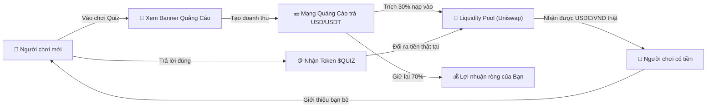

# PRODUCTION_COMMERCIALIZATION_GUIDE.md
lines:286 exports:
---
# 🚀 HƯỚNG DẪN THỰC THI THƯƠNG MẠI HÓA TOÀN DIỆN (MAINNET & MONETIZATION)
## Dự án: Quick Quiz — Learn to Earn Crypto Web3 Platform

Tài liệu này hướng dẫn chi tiết từng bước để đưa dự án **Quick Quiz** từ môi trường thử nghiệm (Testnet / Localhost) ra **vận hành thương mại thật (Mainnet)** trên thị trường toàn cầu, thu hút người chơi và tạo ra dòng tiền thật cho chủ dự án.

---

## MỤC LỤC
1. [Mô hình kinh tế & Dòng tiền (Business Model)](#1-mô-hình-kinh-tế--dòng-tiền-business-model)
2. [Bước 1: Đưa Web lên Internet (Domain & Hosting)](#bước-1-đưa-web-lên-internet-domain--hosting)
3. [Bước 2: Deploy Smart Contract lên Base Mainnet & Trạng thái Base Sepolia](#bước-2-deploy-smart-contract-lên-base-mainnet)
4. [Bước 3: Gắn Mạng Quảng Cáo & Cổng Sponsor Gate Mở Tab Mới](#bước-3-gắn-mạng-quảng-cáo-kích-hoạt-nguồn-thu)
5. [Bước 4: Tạo Thanh Khoản cho Token $QUIZ trên sàn DEX](#bước-4-tạo-thanh-khoản-cho-token-quiz-trên-sàn-dex)
6. [Bước 5: Thiết lập Chống Bot & Bảo vệ Quỹ Thưởng](#bước-5-thiết-lập-chống-bot--bảo-vệ-quỹ-thưởng)
7. [Dự toán Chi phí Vốn & Doanh thu Dự phóng (Dữ liệu Thực tế 2025–2026)](#7-dự-toán-chi-phí-vốn--doanh-thu-dự-phóng-dữ-liệu-thực-tế-20252026)
8. [Chiến lược Marketing & Mở rộng người chơi (GTM)](#8-chiến-lược-marketing--mở-rộng-người-chơi-gtm)

---

## 1. Mô hình kinh tế & Dòng tiền (Business Model)

### 1.1. Vòng lặp kinh tế tự động (Economic Flywheel)

### 1.2. Tại sao Chủ dự án KHÔNG phải bù lỗ tiền gas?
- Dự án áp dụng công nghệ **EIP-712 Structured Data Signing (Chữ ký mật ngoài chuỗi)**.
- Khi người chơi bấm nhận thưởng:
  1. Máy chủ Next.js của bạn chỉ ký một chuỗi mật mã xác nhận hợp lệ (hoàn toàn **miễn phí, 0 đồng**).
  2. Người chơi tự dùng ví MetaMask/Rainbow của họ để gửi giao dịch lên blockchain Base và **tự trả phí gas** (trên mạng Base chỉ tốn khoảng `0.001$` = 25 VNĐ / giao dịch).
